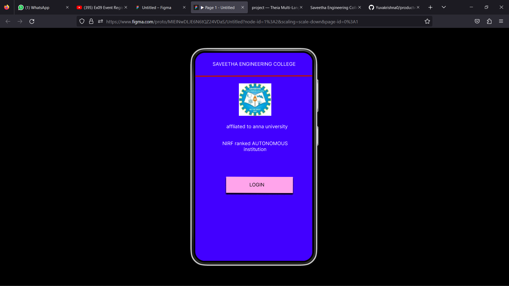

# Event Registration Web Application

## AIM:
To design, develop and deploy a web application for event registration.

## DESIGN STEPS:

### Step 1:
Create a new frame.

### Step 2:
Select any one preset size of your choice.

### Step 3:
Select the shapes you need.

### Step 4:
Import images as needed.

### Step 5:
Create pages based on your need and link them.

### Step 6:

Validate the HTML and CSS code.

### Step 6:

Publish the website in the given URL.

## DESIGN TOOL:
Figma

## program:

'''
/* home page */

position: relative;
width: 360px;
height: 640px;
background: #4200FF;

/* login page */\

position: relative;
width: 360px;
height: 640px;
background: #FF0F00;

/* SAVEETHA ENGINEERING COLLEGE */

position: absolute;
width: 312px;
height: 47px;
left: 11px;
top: 22px;
font-family: 'Inter';
font-style: normal;
font-weight: 400;
font-size: 15px;
line-height: 18px;
text-align: center;
color: #FFFFFF;

/* Departments */

position: absolute;
width: 312px;
height: 47px;
left: 11px;
top: 236px;
font-family: 'Inter';
font-style: normal;
font-weight: 400;
font-size: 20px;
line-height: 24px;
text-align: center;
color: #FFFFFF;

/* AI-ML */

position: absolute;
width: 312px;
height: 47px;
left: 11px;
top: 309px;
font-family: 'Inter';
font-style: normal;
font-weight: 400;
font-size: 20px;
line-height: 24px;
text-align: center;
color: #FFFFFF;

/* AI-DS */

position: absolute;
width: 312px;
height: 47px;
left: 11px;
top: 369px;
font-family: 'Inter';
font-style: normal;
font-weight: 400;
font-size: 20px;
line-height: 24px;
text-align: center;
color: #FFFFFF;

/* AI-DS */

position: absolute;
width: 312px;
height: 47px;
left: 11px;
top: 369px;
font-family: 'Inter';
font-style: normal;
font-weight: 400;
font-size: 20px;
line-height: 24px;
text-align: center;
color: #FFFFFF;

/* IT */

position: absolute;
width: 312px;
height: 47px;
left: 11px;
top: 489px;
font-family: 'Inter';
font-style: normal;
font-weight: 400;
font-size: 20px;
line-height: 24px;
text-align: center;
color: #FFFFFF;

/* IOT */

position: absolute;
width: 312px;
height: 47px;
left: 11px;
top: 429px;
font-family: 'Inter';
font-style: normal;
font-weight: 400;
font-size: 20px;
line-height: 24px;
text-align: center;
color: #FFFFFF;

/* Line 3 */

position: absolute;
width: 360.07px;
height: 0px;
left: 0px;
top: 70.18px;
border: 4px solid #000000;
transform: rotate(-0.19deg);

/* logo 3 */

position: absolute;
width: 99px;
height: 100px;
left: 216px;
top: 83px;
background: url(logo.jpg);
transform: matrix(-1, 0, 0, 1, 0, 0);

'''

## OUTPUT:

## RESULT:
The program to design, develop and deploy a web application for event registration is completed successfully.